# First version
In this first version, I tried on 12 cases (left the 14 behind). All history outputs with losses in both models and accuracies are in the notebook `GANs-Improvement.ipynb` provided. And **case 2** took longer time so I ran it on an another server, the whole output is in `out_images_2.txt`. 

## Summary

|**Change**|**Expectations with discussion**|  **Original result** | **Result** (at epoch 29800/or 99800 for idea 2)|  **Classification** (based on the results)|
|:----|:----|:------------:|:--------------:|:---|
|1. Replace line 99 `X_train = X_train.astype('float32') / 255.0` with `X_train = X_train / 127.5 - 1`.|Changing this line is to change the range of the features inside each data from range $[0.,1.]$ into $[-1., 1.]$. This is indeed data normalization. Based on the trained results from original source code, wider range means the features are separated more and become much more distinct for each data. Hope the representations will get better. |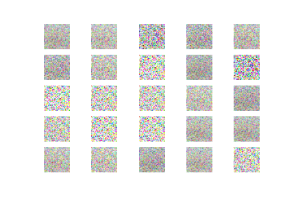 **D loss: `0.742246`, acc.: `9.38%`, G loss: `0.709937`**|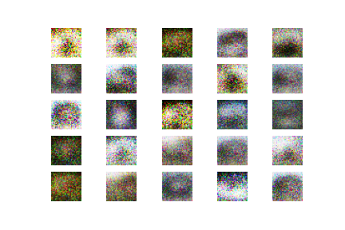 **D loss: `0.709631`, acc.: `48.44%`, G loss: `0.735589`** |improve the quality of the generated samples|
|2. Enlarge the number of “epochs” (actually iterations) from 30k to 100k.| What I really see while training the original source code is that the losses in discriminator model keep decreasing to a limit and then increase again, while the losses in generator model keeps decreasing. And the discriminator accuracies keep becoming lower and lower. So I wonder what might be the case if we train more. However, as the generated data (faked ones) in the generator and the discriminator are trained with random inputs. There should be the time all types of features of data are learnt from both models. At this time the representations would be better for sure. I believe we can hope for better performance with this case. | **D loss: `0.742246`, acc.: `9.38%`, G loss: `0.709937`**|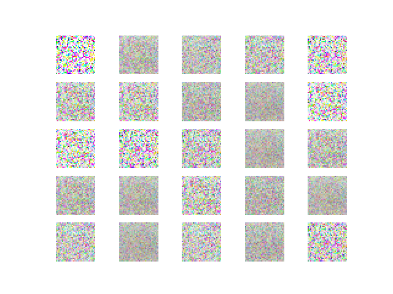 **D loss: `0.702673`, acc.: `21.88%`, G loss: `0.698610`**|(doubtedly) have a low impact where it is unclear if it would improve the quality of the generated samples or not|
|3. Decrease the batch size (from $32$ to $16$).|This is, in my opinion, not really a good idea. We have the same time training for both models. The best way should be to let the 2 models learn more about the data instead of training less (smaller batch size, less learn). There's no way to ensure that the randomized with smaller batches would capture all the features like the original one. Even with `batch_size=32` we haven't obtained any positive results. So this will for sure be worse than the original one.| **D loss: `0.742246`, acc.: `9.38%`, G loss: `0.709937`**| 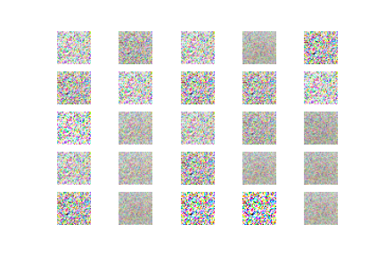 **D loss: `0.729293`, acc.: `37.50%`, G loss: `0.693201`**| (seems to be sure) have a low impact where it is unclear if it would improve the quality of the generated samples or not|
|4. Enlarge the number of neurons in each Dense layer (double the number of neurons in each one).|More neurons in each Dense layer means the features are splitted more. Who can assure that which features should stay together, which one should be splitted? I believe choosing a wise number of neurons for each Dense layer is also a must. To be honest, I'd rather stay at the chosen numbers in the original source code. I guess the representations get worse with this case.| **D loss: `0.742246`, acc.: `9.38%`, G loss: `0.709937`**|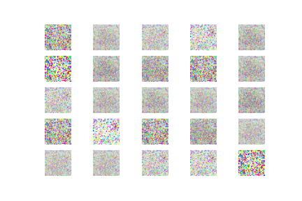 **D loss: `0.724152`, acc.: `14.06%`, G loss: `0.704026`**| disminish the quality of the generated samples|
|5. Visualise the generated samples and print the loss less often.|I think there is not much to consider with this idea. Choosing when to visualize and when to print the loss doesn't make any changes at the data. So | **D loss: `0.742246`, acc.: `9.38%`, G loss: `0.709937`**| same as original| Have a low impact where it is unclear if it would improve the quality of the generated samples or not|
|6. Line 123: remove the 0.5 multiplication|I guess this one has rarely any impact. In fact, the losses are reduced at a half, but only in term of the discriminator. And this doesn't make sense in training the input nor the hidden layers.| **D loss: `0.742246`, acc.: `9.38%`, G loss: `0.709937`**|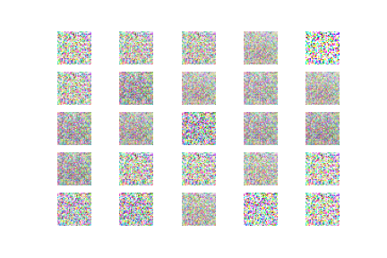 **D loss: `1.502014`, acc.: `37.50%`, G loss: `0.724038`** | (probably) have a low impact where it is unclear if it would improve the quality of the generated samples or not|
|7. Enlarge the latent dimension, see `self.latent_dim` (line 23) to `200`.| Larger latent dimensions means more features of a data point to be under consideration for the generator to learn and fake a 'good' data. This is also similar to the case of **case 4**. We have to choose wisely how large this dimension should be. As least the features are not splitted as much as in case 4, so I think the representations could be better.| **D loss: `0.742246`, acc.: `9.38%`, G loss: `0.709937`**|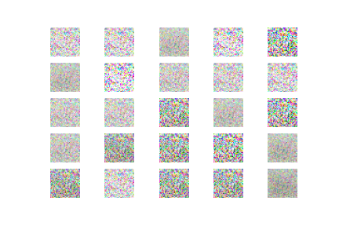 **D loss: `0.746000`, acc.: `20.31%`, G loss: `0.695980`** |(slightly) disminish the quality of the generated samples|
|8. Adjust the Adam learning rate (line 25).|Normally, choosing a learning rate for the optimizer is also important. For sure this learning rate must be in range $(0,1)$. The default learning rate, in my view, is really small. So I try with an another one, $0.001$, which is normally used for SGD optimizer in most models that I once learnt and tried to train. So this choice is based more on my experiences. I believe it can result in better representations. | **D loss: `0.742246`, acc.: `9.38%`, G loss: `0.709937`**|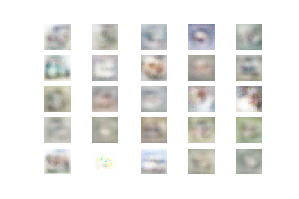 **D loss: `0.623410`, acc.: `62.50%`, G loss: `1.736980`**|(definitely) improve the quality of the generated samples|
|9. Set in line 41 the discriminator trainability to True.|I have no idea what should be expected in this case. I thought the discriminator is always trained during times? Any result would make sense or make no sense.| **D loss: `0.742246`, acc.: `9.38%`, G loss: `0.709937`**|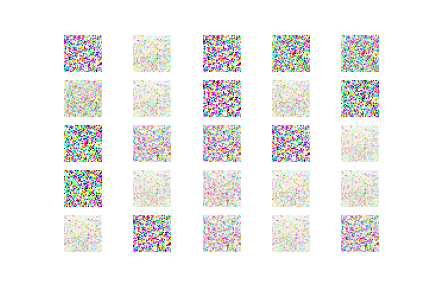 **D loss: `0.752134`, acc.: `50.00%`, G loss: `0.462791`**|(doubtly) improve the quality of the generated samples|
|10. Remove the batch normalization lines (58, 61, 64).|It is really important during building networks to have normalization in each layer. When we remove all kinds of batch normalizations, there is no doubt that the results get worse.| **D loss: `0.742246`, acc.: `9.38%`, G loss: `0.709937`**|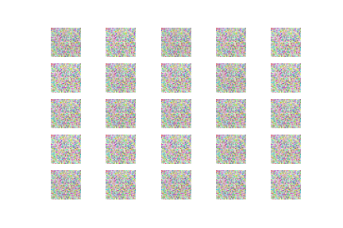 **D loss: `0.691565`, acc.: `31.25%`, G loss: `0.687907`** |(probably) disminish the quality of the generated samples|
|11. Add Dropout|What I wonder is which neuron would be dropped out. Will that be the important ones or the noises. So the chances are 50-50. It's kind of hard to predict which way the result would go.| **D loss: `0.742246`, acc.: `9.38%`, G loss: `0.709937`**|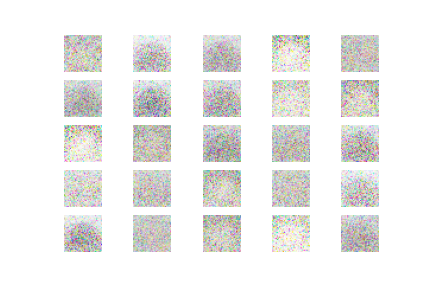 **D loss: `0.692664`, acc.: `46.88%`, G loss: `0.775617`**|(probably) improve the quality of the generated samples|
|12. Change the `binary_crossentropy` loss to the L2 loss|What we are doing with the discriminator is trying to classify the fake and real data generated from the generator. So this is a classification task. So probability should be put in consideration. And the loss as well. MSE/L2 loss would be used more in case of task that needs regressions. I think even when we have some kinds of better results (in losses and accuracies), this change doesn't help the representation at all. At least, I hope it wouldn't worsen the quality of the generated samples.| **D loss: `0.742246`, acc.: `9.38%`, G loss: `0.709937`**|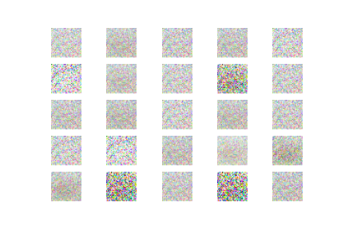 **D loss: `0.262141`, acc.: `43.75%`, G loss: `0.275556`** |(seemingly) disminish the quality of the generated samples|
|13. Add more layers for a deeper network, 2 layers more for the generator, and 1 more for the discriminator|My own experience with deeper network was quite bad. Whenever I tried a normal model of NN with more layers, the outputs become worse and worse. So if I have to say, I don't have trust that the quality of samples would be better, just hope it won't get disminished.| **D loss: `0.742246`, acc.: `9.38%`, G loss: `0.709937`**| **D loss: `0.759966`, acc.: `3.12%`, G loss: `0.734740`**|(well, it has no impact at all, it is like the original result with bolder tone) have no impact where it is unclear if it would improve the quality of the generated samples or not|
|14. Exchange the dense layers with convolutional ones.|In many papers, it's already shown that how CNN performed better over normal MLP model. So I bet this one will improve the quality of the generated samples.| **D loss: `0.742246`, acc.: `9.38%`, G loss: `0.709937`**| not checked (hope someone would)|(hopefully) improve the quality of the generated samples |

**Interesting things**: I made a big mistake!! I should have checked that the learning rate is absolutely so low and that was the main reason why most of the cases that should improve the quality turned into noises. So let's move on to the second run. I called it **second version** and the original source code in this case will be the **case 8** (which seems to generate nice blur images). We'll see what might come then!

